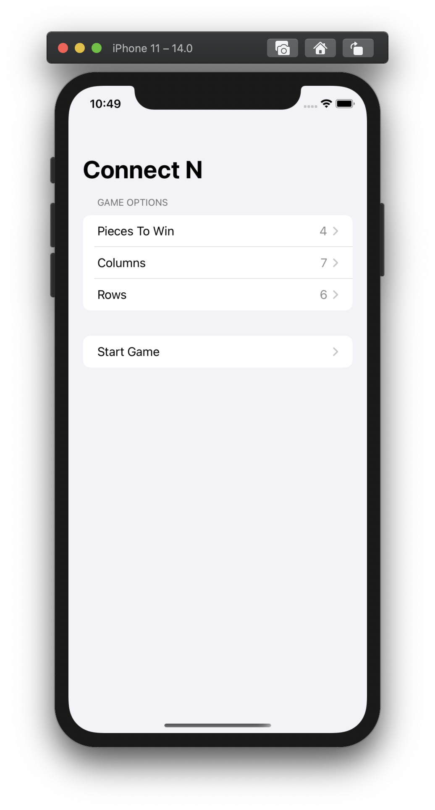
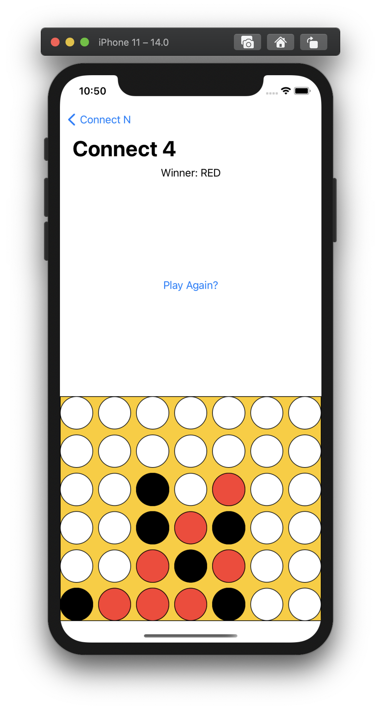

# Connect 4

A Connect4 game made in an afternoon for fun with SwiftUI. Supports dynamic board sizes and custom win lengths.

## Screenshots

|                       |                     |
|:---------------------:|:-------------------:|
|  |  | 
 

## Requirements

- iOS 14.0+
- Xcode 12.0

## Meta

Distributed under the MIT license. See ``LICENSE`` for more information.
